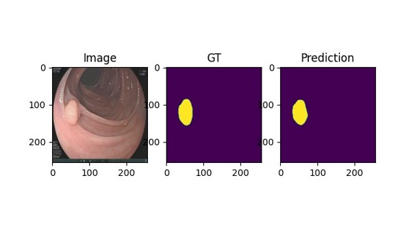
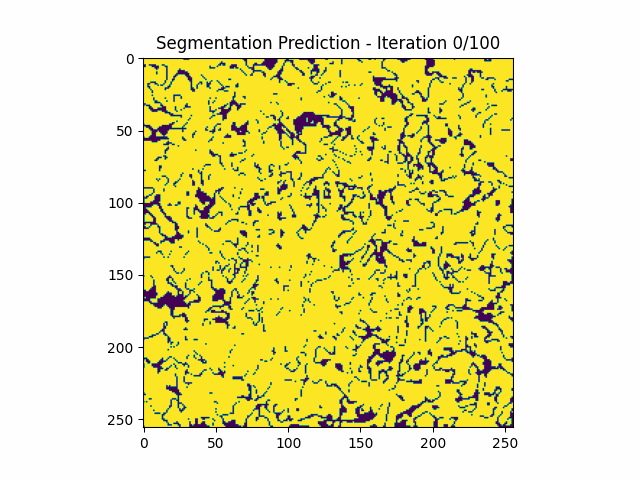

# polyp-segmentation-guided-diffusion
Implementation for polyp segmentation using diffusion transformers.




## Data
In this project we used 2 different datasets, BKAI and Kvasir-SEG. We saved the datasets under a directory named data.

## Split Data
Before training the model, we have to split the datasets to training and testing images.
We wil split them using the save_embedded_images.py file.
For splitting the images, you have to set the following flags:
1. data-path: The path where the dataset is saved. Default - ./data/Kvasir-SEG.
2. images-path: The path of the RGB images. Default - ./data/Kvasir-SEG/images.
3. gt-path: The path of the segmentation masks. Default - ./data/Kvasir-SEG/masks.
4. train-fraction: The fraction of images which will be used for the training set. Default - 0.8.
5. resize: The size of the images. Default - 256.
6. num-augmentations - The number of augmentations which will be used on the images. Default - 8.

For example:
```bash
python save_embedded_images.py --data-path ./data/Kvasir-SEG --images-path ./data/Kvasir-SEG/images --gt-path ./data/Kvasir-SEG/masks 
```
This code will split the images to training and testing sets. In addition, it applies the VAE encoder over the RGB images and their corresponding masks
and saves them. At the end of this code, we have 8 additional directories, train_images, train_gt_images, train_embeddings, 
train_gt_embeddings, test_images, test_gt_images, test_embeddings, test_gt_embeddings.

## Train
To train the diffusion transformer model we use the train.py file. We have to set the following flags:
1. model: The type of the model which will be trained. Default - DiT_S8.
2. data-path: The path where the dataset is saved. Default - ./data/Kvasir-SEG.
3. epochs: Number of epochs for the training process. Default - 150.
4. batch-size: The size of the batches. Default - 16.
5. load-pretrained: If true, loads the pretrained model. Default - False.
6. cross-model: If true, uses the version with the cross-attention layer. Default - true.
7. num-augmentations - The number of augmentations which will be used on the images. Default - 8.

For example:
```bash
python train.py --model DiT_B2 --data-path ./data/Kvasir-SEG --epochs 150 --batch-size 16 cross-model true
```
This line will train a B2 DiT model with cross-attention layers for 150 epochs and with a batch size of 16.
The model will be saved to ./saved_models/model-name.

## Sample
To test the model we use the sample.py file. We have to set the following flags:
1. model: The type of the model which will be trained. Default - DiT_S8.
2. data-path: The path where the dataset is saved. Default - ./data/Kvasir-SEG.
3. epochs: The number of epochs for which the model was trained. Default - 150.
4. batch-size: The size of the batches which were used in the training process. Default - 16.
5. cross-model: If true, uses the model with cross-attention layers. Default - false.
6. num-augmentations: The number of augmentations in the images. Default - 1.
7. ema: If true, uses the parameters of the ema version of the model. Default - true.
8. num-images: The number of images which will be sampled. Default - 50.
9. num-testing-steps: The number of sampling steps. Default - 100.
10. cfg- The value for cfg. Default - 5.0.

For example:
```bash
python sample.py --model DiT_B2 --data-path ./data/Kvasir-SEG --epochs 150 --batch-size 16 cross-model true --num-augmentation 8 --ema true --num-images 200
```
This code will sample 200 images from the testing set using the DiT B2 model. The outputs will be saved to the directory of the model.

## Evaluate
To evaluate the results of the model using the IoU and dice coefficients metrics, we use the segmentation_env.py file.

```bash
python --model DiT_B2 --data-path ./data/Kvasir-SEG --epochs 150 --batch-size 8 --cross-model true --num-augmentations 8 --ema true --num-testing-steps 100
```
This line saves the evaluation results to a txt file in the directory of the model.
